# 银发守护后台管理系统项目展示文档

> 文档中的系统页面截图均基于本地运行环境登录后截取，登录账号为 `admin`，密码为 `123456`。截图内容来自当前数据库中的真实业务数据。

## 一、技术栈页

### 1.1 核心技术栈概述

银发守护后台管理系统采用 Spring Boot + Thymeleaf + MyBatis + MySQL 的传统 Java Web 技术路线。系统整体按照 Controller、Service、Dao、Mapper、Entity、Template 分层组织代码，后端负责业务处理和数据访问，前端页面通过 Thymeleaf 渲染数据并提供后台管理交互。

| 技术 | 项目版本 | 主要用途 | 项目中的体现 |
| --- | --- | --- | --- |
| Java | 1.8 | 项目基础开发语言 | `pom.xml` 中配置 `source`、`target` 均为 1.8 |
| Spring Boot | 2.6.13 | 快速搭建 Web 应用，管理 Bean、MVC、配置和启动流程 | `YinfashouhuApplication` 启动类，`@Controller`、`@Service`、`@Autowired` 等注解 |
| Spring MVC | 由 Spring Boot 2.6.13 管理 | 接收浏览器请求，完成页面跳转、参数绑定和模型数据传递 | `LoginController`、`FrameController`、`UserController` 等控制器 |
| Thymeleaf | 3.0.15.RELEASE | 服务端模板渲染，将后端 Model 数据展示到 HTML 页面 | `templates` 目录下的 `login.html`、`main.html`、`pages/user-info.html` 等 |
| MyBatis Spring Boot Starter | 2.2.2 | 持久层框架，负责 Java 对象与 SQL 查询之间的映射 | `dao` 接口配合 `resources/mappers/*.xml` 完成数据库操作 |
| MySQL | 5.7.21 | 系统业务数据存储 | 数据库备份文件显示服务端版本为 MySQL 5.7.21，库名为 `yinfashouhu` |
| MySQL Connector/J | 8.0.31 | Java 连接 MySQL 数据库的 JDBC 驱动 | `application.properties` 中配置 `com.mysql.cj.jdbc.Driver` |
| Maven | 依赖管理工具 | 统一管理项目依赖、编译、测试和打包 | `pom.xml` 和 `spring-boot-maven-plugin` |

### 1.2 技术用途说明

Spring Boot 用于统一管理系统启动、Web 请求处理、依赖注入和配置加载。项目通过 `@SpringBootApplication` 启动应用，通过 Controller 接收页面请求，通过 Service 封装业务逻辑，通过 MyBatis Mapper 执行数据库操作。

Thymeleaf 用于后台管理页面渲染。系统中的左侧菜单、用户列表、老人信息、健康数据、阈值设置等页面都位于 `src/main/resources/templates` 目录下，页面中使用 `th:text`、`th:each`、`th:field`、`th:if` 等标签显示后端传入的数据。

MyBatis 用于实现 SQL 与 Java 对象的映射。项目将 SQL 写在 `src/main/resources/mappers` 目录中，例如 `UserMapper.xml` 负责用户列表查询、新增、修改、删除等 SQL，`UserRoleMapper.xml` 负责用户与角色关联关系维护。

MySQL 用于存储系统中的用户、角色、权限、老人档案、健康数据、设备记录、行为报告、操作日志等业务数据。项目数据库连接配置如下：

```properties
spring.datasource.url=jdbc:mysql://localhost:3306/yinfashouhu?useUnicode=true&characterEncoding=utf8&serverTimezone=Asia/Shanghai
spring.datasource.username=root
spring.datasource.driver-class-name=com.mysql.cj.jdbc.Driver
mybatis.mapper-locations=classpath:mappers/*.xml
mybatis.type-aliases-package=com.dtdx.entity
```

### 1.3 项目分层结构

| 层次 | 目录 | 职责 |
| --- | --- | --- |
| 启动层 | `src/main/java/com/dtdx/YinfashouhuApplication.java` | 启动 Spring Boot 应用 |
| 控制层 | `src/main/java/com/dtdx/controller` | 接收请求、处理页面跳转、向模板传递数据 |
| 业务层 | `src/main/java/com/dtdx/service` | 封装业务规则，如登录校验、角色绑定、删除前清理关联数据 |
| 数据访问层 | `src/main/java/com/dtdx/dao` | 定义 MyBatis 数据访问接口 |
| 实体层 | `src/main/java/com/dtdx/entity` | 定义用户、老人、健康数据、设备、日志等实体类 |
| SQL 映射层 | `src/main/resources/mappers` | 编写 MyBatis XML SQL |
| 页面层 | `src/main/resources/templates` | 编写 Thymeleaf 后台管理页面 |
| 静态资源 | `src/main/resources/static` | 存放 CSS 等静态资源 |

## 二、功能模块页

### 2.1 系统功能总体说明

系统登录成功后进入后台主框架，页面采用顶部导航栏、左侧菜单、右侧内容区的后台管理布局。顶部栏展示系统名称、当前登录用户、主题切换和退出入口；左侧菜单按照业务场景划分功能；右侧内容区加载具体业务页面。

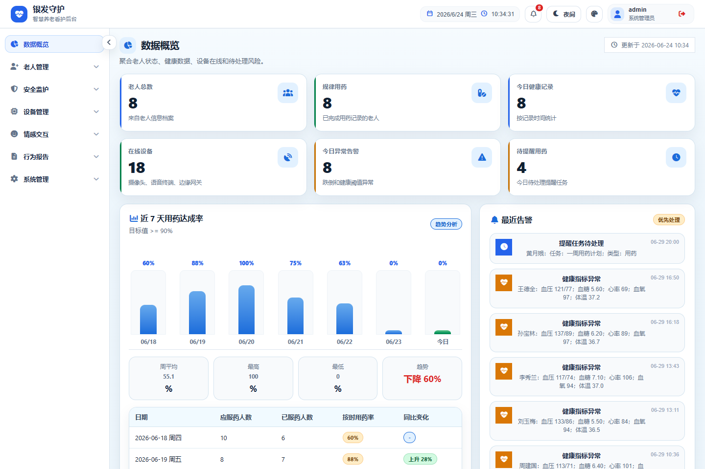

图2-1 系统主框架与左侧菜单

### 2.2 左侧菜单功能说明

| 菜单模块 | 子功能 | 功能说明 | 代表页面 |
| --- | --- | --- | --- |
| 数据概览 | 数据概览 | 展示老人总数、健康数据、异常事件、用药提醒等核心统计信息，作为系统登录后的默认首页。 | `/dashboard` |
| 老人管理 | 老人信息、跌倒记录、健康数据、体检记录、用药提醒 | 管理老人基础档案和护理相关数据，包含老人资料维护、健康指标记录、跌倒记录查看、体检记录维护和用药提醒管理。 | `/elder/elderList`、`/healthData/list` |
| 安全监护 | 事件列表、跌倒记录查询、对话记录、摄像头管理、实时监控 | 记录和展示安全监护过程中的异常事件、跌倒记录、语音对话记录和摄像头状态，帮助护理人员及时掌握风险情况。 | `/record/eventList`、`/record/fallRecordList` |
| 设备管理 | 摄像头管理、语音终端管理、边缘网关管理 | 维护系统接入的硬件设备信息，包括设备名称、安装位置、网络地址、在线状态和备注，便于后续巡检维护。 | `/record/cameraDeviceList`、`/record/voiceTerminalList`、`/record/edgeGatewayList` |
| 情感交互 | 对话交互、提醒任务、陪伴记录 | 记录老人语音对话、提醒任务和陪伴服务过程，用于辅助了解老人情绪、陪伴情况和日常提醒执行情况。 | `/pages/chat.html`、`/record/accompanyRecordList` |
| 行为报告 | 日常报告生成、行为记录管理 | 管理老人日常行为记录，并根据行为数据生成护理报告，为护理评估和健康跟踪提供依据。 | `/report/dailyReportList`、`/report/behaviorRecordList` |
| 系统管理 | 健康阈值设置、角色权限控制、用户管理、操作日志、数据字典 | 维护后台基础配置和权限体系，包括健康指标阈值、用户角色权限、操作日志和数据字典。 | `/hdt/getOne`、`/user/userList` |

### 2.3 左侧菜单模块截图索引

| 菜单模块 | 代表截图 | 截图说明 |
| --- | --- | --- |
| 数据概览 |  | 展示登录后的后台主框架和默认数据概览区域。 |
| 老人管理 | 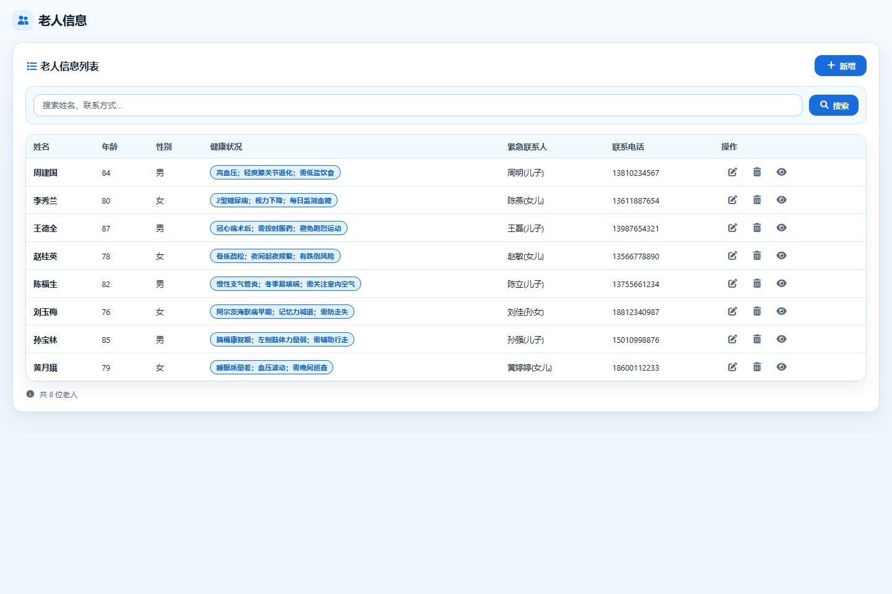 | 展示老人档案列表，也可配合跌倒记录、体检记录和提醒任务页面说明老人管理链路。 |
| 安全监护 |  | 展示事件中心，可查看跌倒、健康异常、提醒任务、异常对话等监护事件。 |
| 设备管理 | 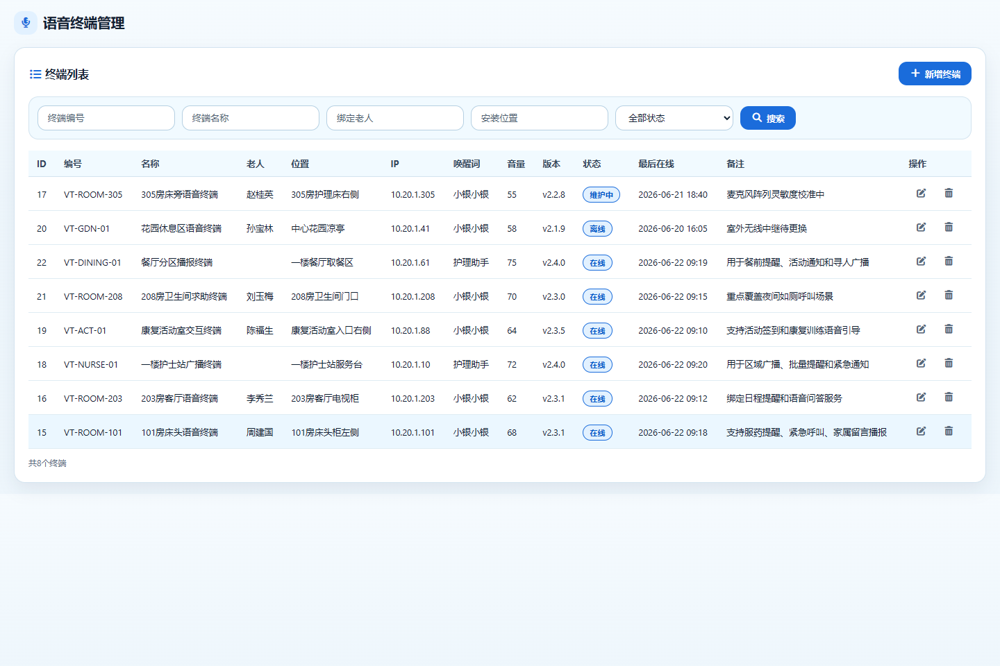 | 展示语音终端设备列表，设备管理还包含摄像头和边缘网关维护。 |
| 情感交互 | 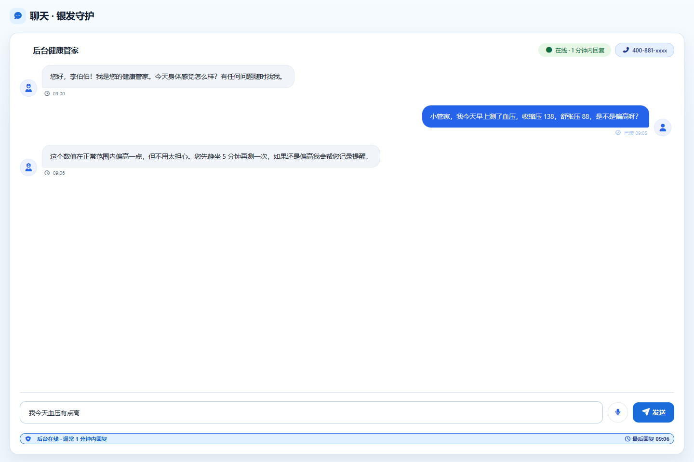 | 展示老人陪伴式对话界面，配合提醒任务和陪伴记录形成情感交互模块。 |
| 行为报告 | 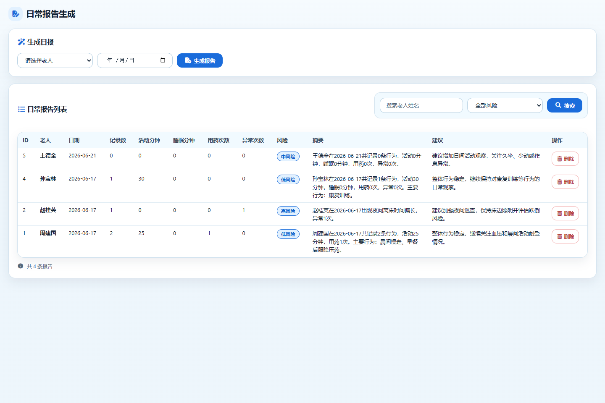 | 展示按老人和日期生成日常行为报告的页面。 |
| 系统管理 | 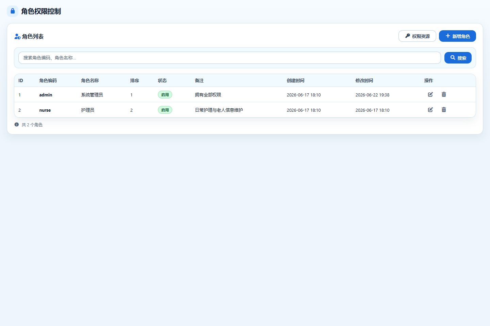 | 展示角色权限控制页面，系统管理还包含用户、日志、数据字典和健康阈值设置。 |

### 2.4 重点功能截图说明

#### 登录页

登录页是系统访问入口，用户输入账号和密码后进入后台管理系统。登录成功后，系统会把当前用户、角色、权限地址等信息写入 Session，用于后续菜单显示和访问控制。

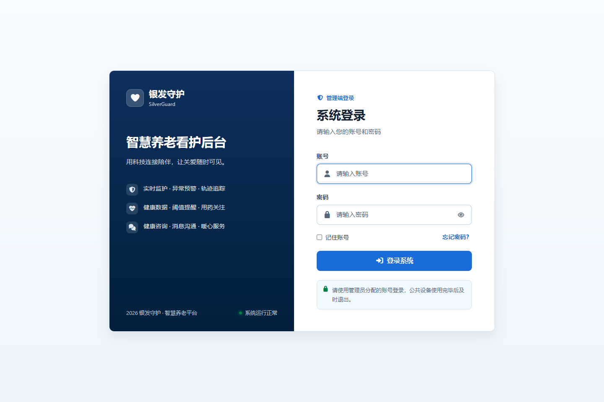

图2-2 登录页，对应访问地址：`/`

#### 老人信息管理

老人信息页面用于维护老人基础档案。页面以表格展示老人姓名、性别、年龄、联系电话、房间号、健康状态等信息，并提供新增、编辑、删除等基础维护能力。


图2-3 老人信息管理，对应访问地址：`/elder/elderList`

#### 健康阈值设置

健康阈值设置页面用于配置健康数据异常判断规则，例如血压、血糖、心率、血氧、体温、体重波动等指标。系统后续可根据阈值判断健康数据是否异常。

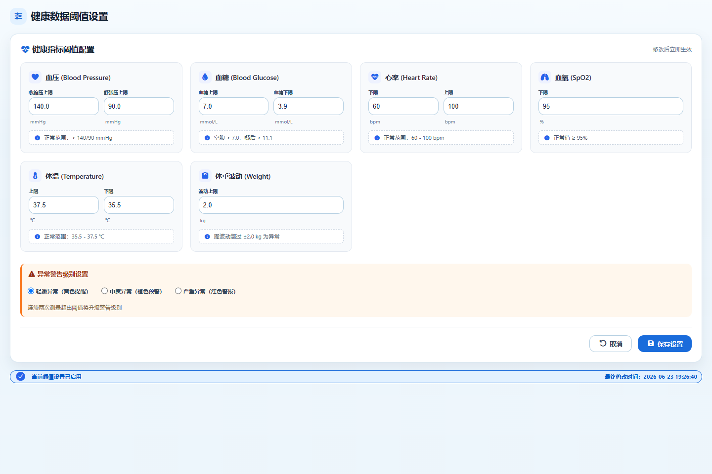

图2-4 健康阈值设置，对应访问地址：`/hdt/getOne`

#### 健康数据记录

健康数据页面用于维护老人每日健康指标，包含血压、血糖、心率、血氧、体温、体重等字段。页面顶部展示统计信息，表格中展示具体记录，便于护理人员追踪健康变化。

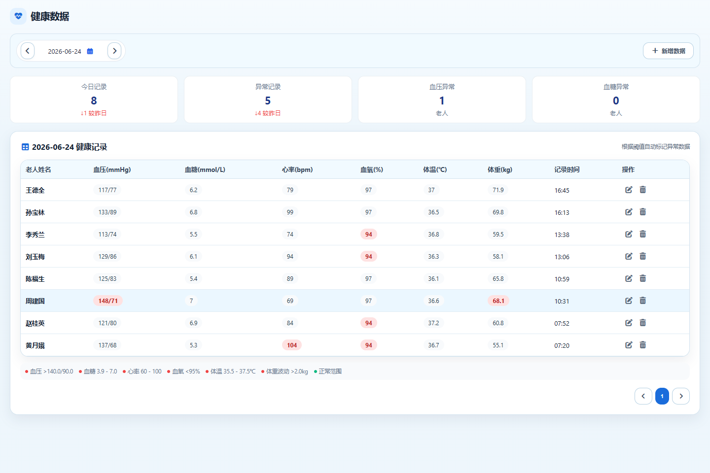

图2-5 健康数据记录，对应访问地址：`/healthData/list`

## 三、核心展示页：用户管理模块

### 3.1 模块概述

用户管理模块位于左侧菜单“系统管理-用户管理”，是后台系统中较完整的 CRUD 功能模块。该模块由学生自主完成从前端页面、控制器、业务服务到 MyBatis 数据访问的完整开发，覆盖用户列表查询、新增表单、编辑回显、删除操作、搜索筛选和角色绑定。

模块访问地址为 `/user/userList`。进入页面后，系统以表格方式展示用户登录名、真实姓名、岗位、性别、电话、邮箱、状态、创建时间和修改时间，并在每行提供编辑与删除入口。

### 3.2 功能流程说明

| 功能点 | 页面或接口 | 实现说明 |
| --- | --- | --- |
| 用户列表查询 | `/user/userList` | Controller 接收查询条件，调用 `userService.userList(user)` 查询用户数据，并将 `userList` 返回到 `pages/user-info` 模板渲染。 |
| 搜索筛选 | `/user/userList?loginName=...&realName=...&phone=...` | 前端输入关键字后，将关键字同时作为登录名、真实姓名和电话查询条件提交，Mapper 使用 `like` 模糊匹配。 |
| 新增表单 | `/user/addView` | 后端创建空 `User` 对象，加载启用角色列表，设置表单提交地址为 `/user/add`。 |
| 新增保存 | `/user/add` | 保存用户基础信息，使用数据库生成的用户 ID 绑定角色，并记录操作日志。 |
| 编辑回显 | `/user/updateView?id=...` | 根据 ID 查询用户详情和已绑定角色 ID，复用用户表单页面完成数据回显。 |
| 编辑保存 | `/user/update` | 更新用户基础信息，重新绑定用户角色关系，并记录修改日志。 |
| 删除操作 | `/user/del?id=...` | 前端弹出确认框；后端先删除用户角色关系，再删除用户主表记录，避免保留无效关联数据。 |

### 3.3 页面截图展示

#### 用户列表查询


图3-1 用户管理列表页

#### 搜索筛选

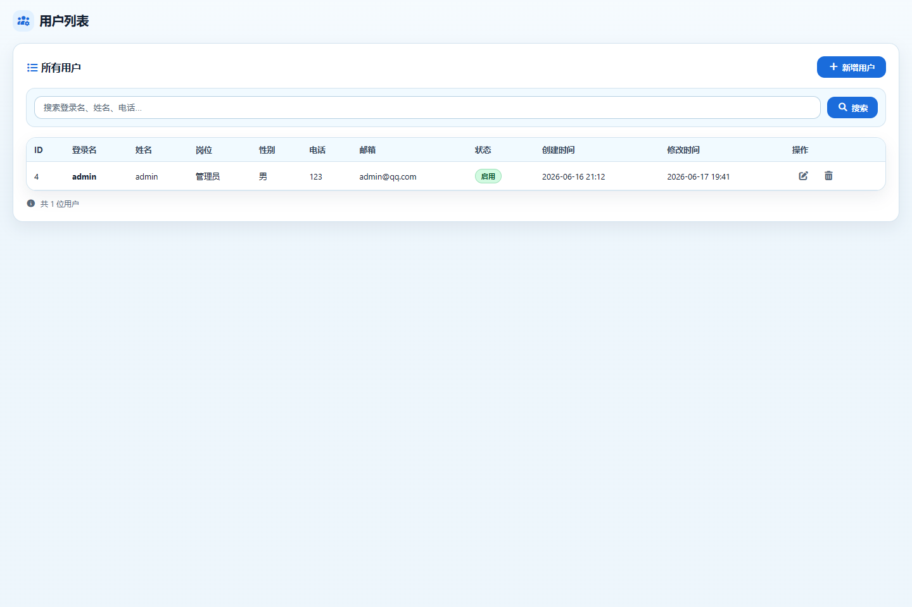

图3-2 用户搜索筛选

#### 新增用户表单

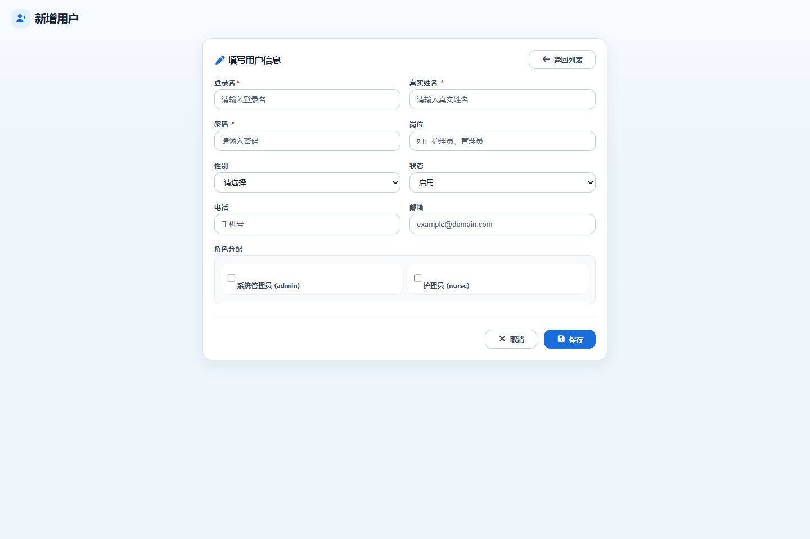

图3-3 新增用户表单

#### 编辑用户回显

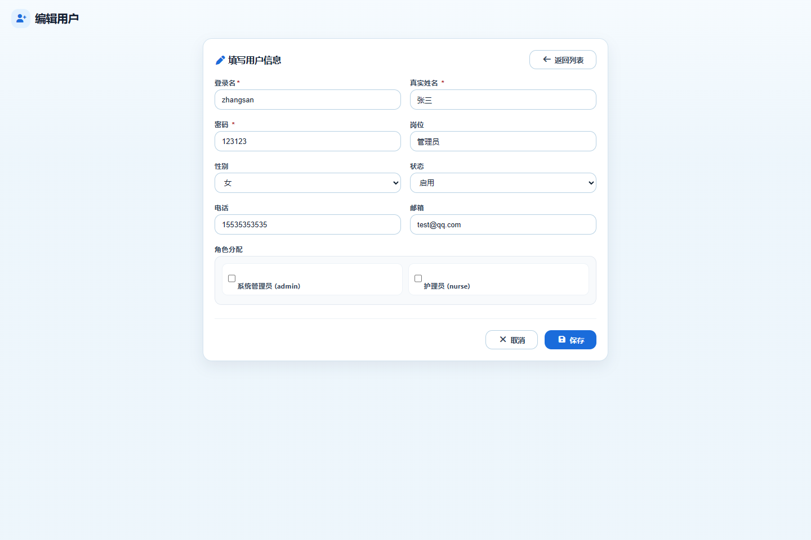

图3-4 编辑用户回显

#### 删除操作入口

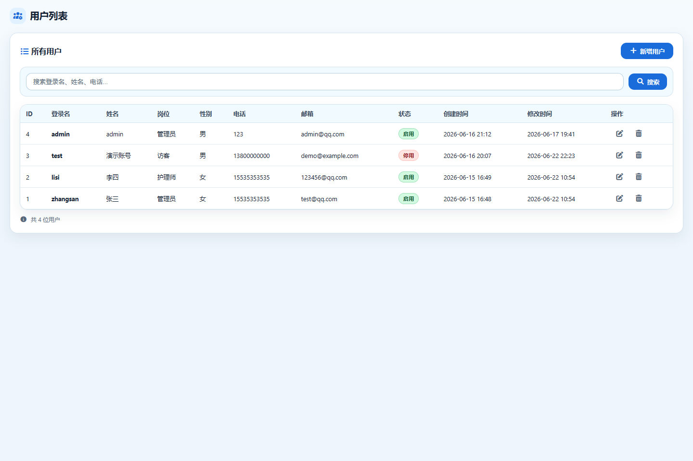

图3-5 用户删除入口

### 3.4 关键代码展示

#### 控制器代码

`UserController` 负责接收用户管理相关请求，包括列表、新增、编辑和删除。

```java
@Controller
@RequestMapping("/user")
public class UserController {
    @Autowired
    private UserService userService;

    @Autowired
    private OperationLogService operationLogService;

    @Autowired
    private RoleService roleService;

    @RequestMapping("/userList")
    public String userList(Model model, User user) {
        List<User> userList = userService.userList(user);
        model.addAttribute("userList", userList);
        return "pages/user-info";
    }

    @RequestMapping("/addView")
    public String addView(Model model) {
        model.addAttribute("user", new User());
        model.addAttribute("roleList", roleService.listAllActive());
        model.addAttribute("selectedRoleIds", null);
        model.addAttribute("formAction", "/user/add");
        return "pages/user-add";
    }

    @RequestMapping("/updateView")
    public String updateView(@RequestParam("id") Integer id, Model model) {
        User user = userService.getById(id);
        model.addAttribute("user", user);
        model.addAttribute("roleList", roleService.listAllActive());
        model.addAttribute("selectedRoleIds", userService.findRoleIdsByUserId(id));
        model.addAttribute("formAction", "/user/update");
        return "pages/user-add";
    }
}
```

#### 新增、编辑、删除业务代码

```java
public void add(User user) {
    if (user.getStatus() == null) {
        user.setStatus(1);
    }
    userDao.add(user);
}

public void update(User user) {
    userDao.update(user);
}

public void delete(Integer id) {
    userRoleDao.deleteByUserId(id);
    userDao.delete(id);
}
```

#### 用户列表动态 SQL

```xml
<select id="userList" resultType="User">
    select
    <include refid="BaseColumnList"/>
    from t_user
    <where>
        <if test="loginName != null and loginName != ''">
            login_name like concat('%', #{loginName}, '%')
        </if>
        <if test="realName != null and realName != ''">
            or real_name like concat('%', #{realName}, '%')
        </if>
        <if test="phone != null and phone != ''">
            or phone like concat('%', #{phone}, '%')
        </if>
    </where>
    order by id desc
</select>
```

#### 搜索和删除前端代码

```javascript
function queryUsers() {
    const keyword = document.getElementById('searchInput').value;
    window.location.href = '/user/userList?loginName=' + encodeURIComponent(keyword)
        + '&realName=' + encodeURIComponent(keyword)
        + '&phone=' + encodeURIComponent(keyword);
}

function delUser(id) {
    if (confirm('确认删除这条用户记录？')) {
        window.location.href = '/user/del?id=' + id;
    }
}
```

#### 表单回显代码

新增和编辑复用 `user-add.html`。编辑时后端传入已有用户对象和已选角色 ID，Thymeleaf 通过 `th:field` 和 `th:checked` 完成表单回显。

```html
<form th:action="${formAction}" method="post" th:object="${user}">
    <input type="hidden" th:field="*{id}">
    <input type="text" th:field="*{loginName}" placeholder="请输入登录名" required>
    <input type="text" th:field="*{realName}" placeholder="请输入真实姓名" required>
    <input type="text" th:field="*{password}" placeholder="请输入密码" required>

    <label class="role-item" th:each="role : ${roleList}">
        <input type="checkbox" name="roleIds" th:value="${role.id}"
               th:checked="${selectedRoleIds != null and selectedRoleIds.contains(role.id)}">
        <span th:text="${role.roleName + ' (' + role.roleCode + ')'}">系统管理员</span>
    </label>
</form>
```

## 四、核心展示页：其他业务模块

> 本节补充展示除登录页、系统主框架、老人信息、健康阈值设置、健康数据记录和用户管理以外的核心功能页面。每个模块均按照“模块概述、功能实现说明、页面截图、关键代码展示、小结”的方式整理，可直接作为项目展示材料使用。

### 4.1 跌倒记录模块

#### 模块概述

跌倒记录模块用于记录和查询老人跌倒事件，是安全监护业务中的重要页面。该模块位于左侧菜单“老人管理-跌倒记录”和“安全监护-跌倒记录查询”，对应访问地址为 `/record/fallRecordList`。页面通过表格展示老人姓名、跌倒时间、跌倒位置、严重等级、处理结果和备注，护理人员可以根据老人姓名和跌倒等级快速筛选记录。

#### 功能实现说明

| 功能点 | 页面/接口 | 实现说明 |
| --- | --- | --- |
| 跌倒记录列表 | `/record/fallRecordList` | Controller 接收 `FallRecord` 查询条件，调用 `fallRecordService.fallRecordList(fallRecord)` 获取记录并返回页面。 |
| 姓名筛选 | `/record/fallRecordList?elderName=...` | 前端表单提交老人姓名，Mapper 按老人姓名进行模糊查询。 |
| 等级筛选 | `/record/fallRecordList?severity=HIGH` | 页面下拉框选择低、中、高等级，后端根据严重等级过滤记录。 |
| 数据展示 | `pages/fall-record-info.html` | Thymeleaf 使用 `th:each` 遍历 `fallRecordList`，并根据等级显示不同样式。 |

#### 页面截图展示

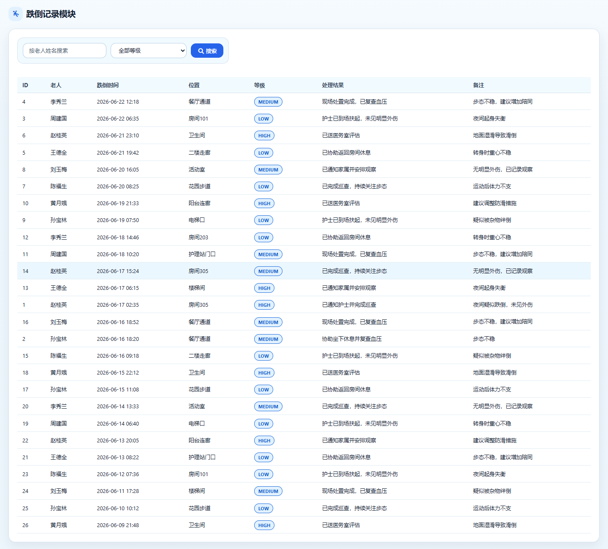

图4-1 跌倒记录模块

#### 关键代码展示

```java
@RequestMapping("/fallRecordList")
public String fallRecordList(Model model, FallRecord fallRecord) {
    model.addAttribute("fallRecordList", fallRecordService.fallRecordList(fallRecord));
    return "pages/fall-record-info";
}
```

```html
<form id="searchForm" action="/record/fallRecordList" method="get"></form>
<input class="input" type="text" name="elderName" placeholder="按老人姓名搜索" form="searchForm">
<select class="select" name="severity" form="searchForm">
    <option value="">全部等级</option>
    <option value="LOW">低</option>
    <option value="MEDIUM">中</option>
    <option value="HIGH">高</option>
</select>
```

```html
<tr th:each="item : ${fallRecordList}">
    <td th:text="${item.elderName}"></td>
    <td th:text="${item.fallTime != null ? #dates.format(item.fallTime, 'yyyy-MM-dd HH:mm') : ''}"></td>
    <td th:text="${item.fallLocation}"></td>
    <td><span class="badge" th:text="${item.severity}"></span></td>
    <td th:text="${item.handleResult}"></td>
</tr>
```

#### 小结

跌倒记录模块实现了养老安全事件的集中查询和展示，能够帮助护理人员根据时间、老人和风险等级追踪跌倒事件处理情况。

### 4.2 体检记录管理模块

#### 模块概述

体检记录管理模块用于维护老人定期体检、专项体检和复查数据，位于左侧菜单“老人管理-体检记录”，对应访问地址为 `/report/checkupRecordList`。页面支持按老人姓名、体检类型、风险等级和状态筛选，能够展示体检日期、体检机构、结果摘要、风险等级、随访建议和备注。

#### 功能实现说明

| 功能点 | 页面/接口 | 实现说明 |
| --- | --- | --- |
| 体检记录列表 | `/report/checkupRecordList` | 查询体检记录并返回 `pages/checkup-record-info` 页面。 |
| 新增体检记录 | `/report/checkupRecordAddView`、`/report/checkupRecordAdd` | 新增页面加载老人列表，提交后保存体检结果和风险等级。 |
| 编辑回显 | `/report/checkupRecordUpdateView?id=...` | 根据记录 ID 查询体检记录并回显到表单。 |
| 删除记录 | `/report/checkupRecordDel?id=...` | 前端确认后提交删除请求，后端删除对应体检记录。 |
| 多条件筛选 | `/report/checkupRecordList?elderName=...&checkupType=...` | 根据姓名、体检类型、风险等级、状态组合查询。 |

#### 页面截图展示

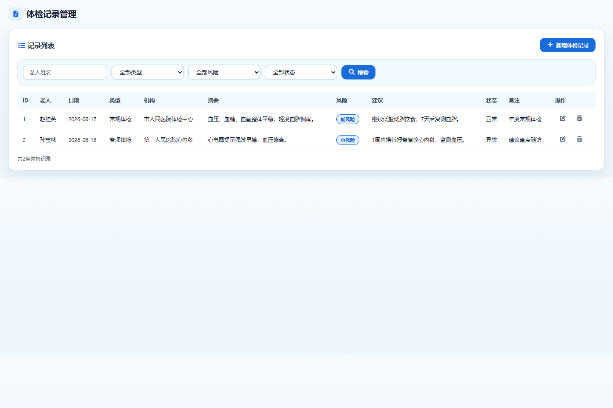

图4-2 体检记录管理

#### 关键代码展示

```java
@RequestMapping("/checkupRecordList")
public String checkupRecordList(Model model, CheckupRecord checkupRecord) {
    model.addAttribute("query", checkupRecord);
    model.addAttribute("checkupRecordList", checkupRecordService.checkupRecordList(checkupRecord));
    return "pages/checkup-record-info";
}
```

```java
@RequestMapping("/checkupRecordAddView")
public String checkupRecordAddView(Model model) {
    model.addAttribute("checkupRecord", new CheckupRecord());
    model.addAttribute("elderList", elderService.elderList(new Elder()));
    model.addAttribute("formAction", "/report/checkupRecordAdd");
    return "pages/checkup-record-form";
}
```

```javascript
function delCheckup(id) {
    if (confirm('确认删除这条体检记录吗？')) {
        location.href = '/report/checkupRecordDel?id=' + id;
    }
}
```

#### 小结

体检记录管理模块补充了老人健康档案中的周期性检查数据，使系统不仅能记录每日健康指标，也能沉淀体检结论和护理建议。

### 4.3 事件列表模块

#### 模块概述

事件列表模块是安全监护中的事件中心，位于左侧菜单“安全监护-事件列表”，对应访问地址为 `/record/eventList`。页面集中展示跌倒告警、健康异常、提醒任务、异常对话等事件，顶部提供事件总数、待处理数量、高等级事件数量和健康异常数量统计。

#### 功能实现说明

| 功能点 | 页面/接口 | 实现说明 |
| --- | --- | --- |
| 事件列表查询 | `/record/eventList` | 查询事件记录并返回事件中心页面。 |
| 事件类型筛选 | `eventType=FALL/HEALTH/REMINDER/DIALOG` | 按跌倒、健康、提醒、对话等类型筛选。 |
| 等级筛选 | `eventLevel=HIGH/MEDIUM/LOW` | 按事件严重等级筛选。 |
| 状态筛选 | `eventStatus=PENDING/DONE` | 区分待处理和已处理事件。 |
| 来源跳转 | `sourceUrl` | 每条事件保留来源地址，可点击进入关联业务页面。 |

#### 页面截图展示


图4-3 事件列表

#### 关键代码展示

```java
@RequestMapping("/eventList")
public String eventList(Model model, EventRecord eventRecord) {
    model.addAttribute("query", eventRecord);
    model.addAttribute("eventRecordList", eventRecordService.eventRecordList(eventRecord));
    return "pages/event-record-info";
}
```

```html
<select class="select" name="eventType">
    <option value="">全部类型</option>
    <option value="FALL">跌倒告警</option>
    <option value="HEALTH">健康异常</option>
    <option value="REMINDER">提醒任务</option>
    <option value="DIALOG">异常对话</option>
</select>
```

```html
<a class="btn btn-secondary" th:href="${item.sourceUrl}">
    <i class="fas fa-arrow-up-right-from-square"></i> 查看
</a>
```

#### 小结

事件列表模块将分散在不同业务页面中的异常情况集中展示，便于值班人员优先处理高等级和待处理事件。

### 4.4 对话记录模块

#### 模块概述

对话记录模块位于左侧菜单“安全监护-对话记录”，对应访问地址为 `/record/dialogRecordList`。系统通过该页面保存老人日常语音交互内容，包括老人姓名、对话时间、发言人、对话内容、情绪识别结果和备注。

#### 功能实现说明

| 功能点 | 页面/接口 | 实现说明 |
| --- | --- | --- |
| 对话记录列表 | `/record/dialogRecordList` | 查询并展示老人对话记录。 |
| 老人姓名筛选 | `elderName=...` | 根据老人姓名定位对话内容。 |
| 发言人筛选 | `speaker=...` | 区分老人、护理员或系统终端发言。 |
| 情绪筛选 | `emotion=NORMAL/HAPPY/SAD/ANXIOUS` | 按识别到的情绪状态过滤记录。 |

#### 页面截图展示

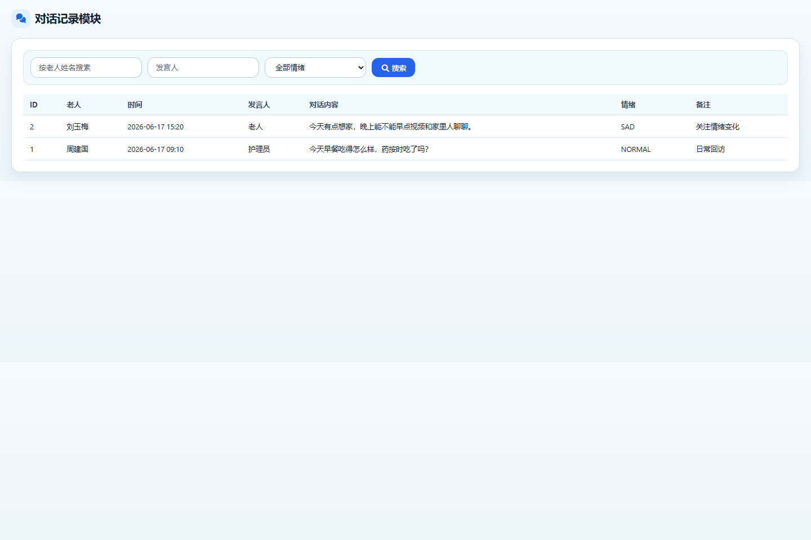

图4-4 对话记录模块

#### 关键代码展示

```java
@RequestMapping("/dialogRecordList")
public String dialogRecordList(Model model, DialogRecord dialogRecord) {
    model.addAttribute("dialogRecordList", dialogRecordService.dialogRecordList(dialogRecord));
    return "pages/dialog-record-info";
}
```

```html
<input class="input" type="text" name="elderName" placeholder="按老人姓名搜索" form="searchForm">
<input class="input" type="text" name="speaker" placeholder="发言人" form="searchForm">
<select class="select" name="emotion" form="searchForm">
    <option value="">全部情绪</option>
    <option value="NORMAL">正常</option>
    <option value="HAPPY">开心</option>
    <option value="SAD">低落</option>
    <option value="ANXIOUS">焦虑</option>
</select>
```

#### 小结

对话记录模块把语音交互内容结构化保存，为情绪分析、陪伴服务复盘和异常对话追踪提供数据来源。

### 4.5 摄像头管理模块

#### 模块概述

摄像头管理模块同时服务于“安全监护”和“设备管理”，对应访问地址为 `/record/cameraDeviceList`。页面用于维护摄像头设备名称、安装位置、IP 地址、在线状态、最后在线时间和备注，支持新增、编辑、删除和多条件搜索。

#### 功能实现说明

| 功能点 | 页面/接口 | 实现说明 |
| --- | --- | --- |
| 摄像头列表 | `/record/cameraDeviceList` | 查询摄像头设备并展示状态。 |
| 新增设备 | `/record/cameraDeviceAddView`、`/record/cameraDeviceAdd` | 新增摄像头基础信息。 |
| 编辑设备 | `/record/cameraDeviceUpdateView?id=...`、`/record/cameraDeviceUpdate` | 根据 ID 回显并更新设备信息。 |
| 删除设备 | `/record/cameraDeviceDel?id=...` | 删除指定摄像头记录。 |
| 设备筛选 | `deviceName`、`deviceLocation`、`deviceIp`、`status` | 按名称、位置、IP 和状态组合查询。 |

#### 页面截图展示

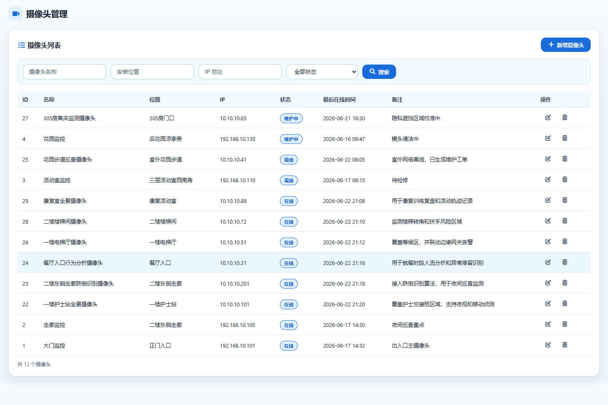

图4-5 摄像头管理

#### 关键代码展示

```java
@RequestMapping("/cameraDeviceList")
public String cameraDeviceList(Model model, CameraDevice cameraDevice) {
    model.addAttribute("query", cameraDevice);
    model.addAttribute("cameraDeviceList", cameraDeviceService.cameraDeviceList(cameraDevice));
    return "pages/camera-device-info";
}
```

```javascript
function delCamera(id) {
    if (confirm('确认删除该摄像头吗？')) {
        location.href = '/record/cameraDeviceDel?id=' + id;
    }
}
```

```html
<td><span class="badge"
          th:classappend="${item.status == 'ONLINE' ? ' online' : (item.status == 'OFFLINE' ? ' offline' : ' maintenance')}"
          th:text="${item.status == 'ONLINE' ? '在线' : (item.status == 'OFFLINE' ? '离线' : '维护中')}"></span></td>
```

#### 小结

摄像头管理模块为安全监控场景提供设备基础数据，方便管理员维护摄像头安装位置和在线状态。

### 4.6 实时监控模块

#### 模块概述

实时监控模块位于左侧菜单“安全监护-实时监控”，对应访问地址为 `/pages/camera-info.html`。页面通过地图式视图模拟老人定位场景，展示当前追踪人数、重点关注人数、告警人数、老人点位、楼层图层和最近事件。

#### 功能实现说明

| 功能点 | 页面/接口 | 实现说明 |
| --- | --- | --- |
| 地图展示 | `/pages/camera-info.html` | `FrameController` 返回 `pages/camera-info` 页面。 |
| 位置刷新 | `randomizePositions()` | 前端模拟刷新老人位置点位。 |
| 楼层切换 | `toggleFloorLayer()` | 在一楼、二楼、三楼图层之间切换。 |
| 状态统计 | `syncCounts()` | 统计当前追踪、重点关注和告警老人数量。 |

#### 页面截图展示

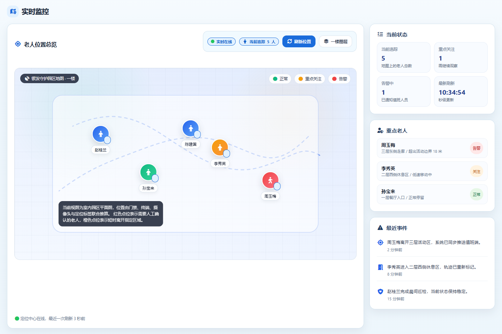

图4-6 实时监控

#### 关键代码展示

```java
@RequestMapping("/pages/camera-info.html")
public String cameraInfoHtml() {
    return "pages/camera-info";
}
```

```javascript
function syncCounts() {
    const total = elderNodes.length;
    const watch = elderNodes.filter(function(el) {
        return el.classList.contains('warn') || el.classList.contains('alert');
    }).length;
    const alert = elderNodes.filter(function(el) {
        return el.classList.contains('alert');
    }).length;
    document.getElementById('trackedCount').textContent = String(total);
    document.getElementById('watchCount').textContent = String(watch);
    document.getElementById('alertCount').textContent = String(alert);
}
```

```javascript
function toggleFloorLayer() {
    currentFloorIndex = (currentFloorIndex + 1) % floorLayers.length;
    const layer = floorLayers[currentFloorIndex];
    document.getElementById('floorText').textContent = layer.name;
    document.getElementById('mapLayerName').textContent = layer.label;
}
```

#### 小结

实时监控模块以可视化方式呈现老人位置和告警状态，适合作为安全监护业务的前台展示页面。

### 4.7 语音终端管理模块

#### 模块概述

语音终端管理模块位于“设备管理-语音终端管理”，对应访问地址为 `/record/voiceTerminalList`。该模块用于维护老人绑定的语音终端设备，包括终端编号、终端名称、绑定老人、安装位置、设备 IP、唤醒词、音量、固件版本、在线状态和最后在线时间。

#### 功能实现说明

| 功能点 | 页面/接口 | 实现说明 |
| --- | --- | --- |
| 终端列表 | `/record/voiceTerminalList` | 展示语音终端基础信息和在线状态。 |
| 新增终端 | `/record/voiceTerminalAddView`、`/record/voiceTerminalAdd` | 加载老人列表并保存终端信息。 |
| 编辑终端 | `/record/voiceTerminalUpdateView?id=...` | 查询终端详情并回显表单。 |
| 删除终端 | `/record/voiceTerminalDel?id=...` | 删除指定语音终端。 |
| 多条件搜索 | `terminalCode`、`terminalName`、`elderName`、`status` | 支持按编号、名称、老人和状态查询。 |

#### 页面截图展示


图4-7 语音终端管理

#### 关键代码展示

```java
@RequestMapping("/voiceTerminalList")
public String voiceTerminalList(Model model, VoiceTerminal voiceTerminal) {
    model.addAttribute("query", voiceTerminal);
    model.addAttribute("voiceTerminalList", voiceTerminalService.voiceTerminalList(voiceTerminal));
    return "pages/voice-terminal-info";
}
```

```java
@RequestMapping("/voiceTerminalAddView")
public String voiceTerminalAddView(Model model) {
    model.addAttribute("voiceTerminal", new VoiceTerminal());
    model.addAttribute("elderList", elderService.elderList(new Elder()));
    model.addAttribute("formAction", "/record/voiceTerminalAdd");
    return "pages/voice-terminal-form";
}
```

```javascript
function delVoice(id) {
    if (confirm('确认删除该终端吗？')) {
        location.href = '/record/voiceTerminalDel?id=' + id;
    }
}
```

#### 小结

语音终端管理模块把老人、终端和安装位置关联起来，为后续对话交互、提醒任务和陪伴服务提供设备支撑。

### 4.8 边缘网关管理模块

#### 模块概述

边缘网关管理模块位于“设备管理-边缘网关管理”，对应访问地址为 `/record/edgeGatewayList`。该页面用于维护园区内边缘网关信息，包含网关编号、名称、安装位置、IP、MAC 地址、接入协议、管理设备数、固件版本、在线状态和最后心跳时间。

#### 功能实现说明

| 功能点 | 页面/接口 | 实现说明 |
| --- | --- | --- |
| 网关列表 | `/record/edgeGatewayList` | 查询边缘网关设备并展示状态。 |
| 新增网关 | `/record/edgeGatewayAddView`、`/record/edgeGatewayAdd` | 保存网关编号、协议、位置等基础信息。 |
| 编辑网关 | `/record/edgeGatewayUpdateView?id=...` | 根据 ID 回显网关数据。 |
| 删除网关 | `/record/edgeGatewayDel?id=...` | 删除指定网关记录。 |
| 状态筛选 | `status=ONLINE/OFFLINE/MAINTENANCE` | 按在线、离线、维护中筛选。 |

#### 页面截图展示

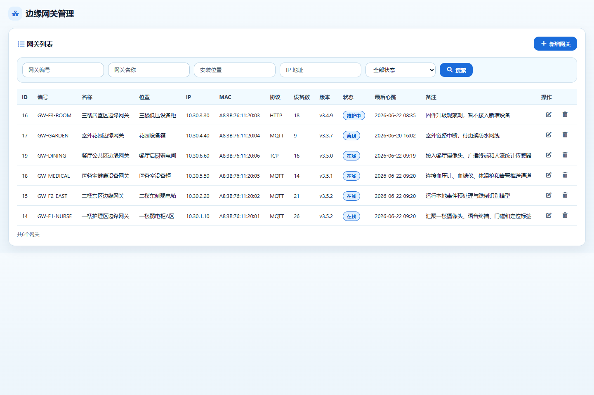

图4-8 边缘网关管理

#### 关键代码展示

```java
@RequestMapping("/edgeGatewayList")
public String edgeGatewayList(Model model, EdgeGateway edgeGateway) {
    model.addAttribute("query", edgeGateway);
    model.addAttribute("edgeGatewayList", edgeGatewayService.edgeGatewayList(edgeGateway));
    return "pages/edge-gateway-info";
}
```

```html
<input class="input" name="gatewayCode" placeholder="网关编号">
<input class="input" name="gatewayName" placeholder="网关名称">
<input class="input" name="gatewayIp" placeholder="IP 地址">
<select class="select" name="status">
    <option value="">全部状态</option>
    <option value="ONLINE">在线</option>
    <option value="OFFLINE">离线</option>
    <option value="MAINTENANCE">维护中</option>
</select>
```

#### 小结

边缘网关管理模块体现了系统对物联网设备接入层的维护能力，方便管理员定位网关故障和设备接入状态。

### 4.9 对话交互模块

#### 模块概述

对话交互模块位于“情感交互-对话交互”，对应访问地址为 `/pages/chat.html`。页面以聊天窗口形式模拟老人和系统之间的陪伴式交流，包含消息列表、输入框、发送按钮、语音按钮、服务状态和最近回复时间。

#### 功能实现说明

| 功能点 | 页面/接口 | 实现说明 |
| --- | --- | --- |
| 聊天页面 | `/pages/chat.html` | `FrameController` 返回聊天模板页面。 |
| 文本发送 | `sendUserMessage()` | 获取输入框内容并追加到聊天列表。 |
| 模拟回复 | `setTimeout` | 用户发送后模拟系统响应。 |
| 语音状态 | `voiceButton` 点击事件 | 模拟语音输入监听状态。 |

#### 页面截图展示


图4-9 对话交互

#### 关键代码展示

```java
@RequestMapping("/pages/chat.html")
public String chatHtml() {
    return "pages/chat";
}
```

```javascript
function createMessage(text, type) {
    const message = document.createElement('div');
    message.className = 'message ' + type;
    message.innerHTML = '<div class="bubble">' + text + '</div>';
    messageList.appendChild(message);
    scrollToBottom();
}
```

```javascript
function sendUserMessage() {
    const text = inputField.value.trim();
    if (!text) {
        return;
    }
    createMessage(text, 'user');
    inputField.value = '';
}
```

#### 小结

对话交互模块展示了系统面向老人情感陪伴的交互入口，与对话记录和语音终端管理共同形成情感交互业务链路。

### 4.10 提醒任务模块

#### 模块概述

提醒任务模块位于“情感交互-提醒任务”和“老人管理-用药提醒”，对应访问地址为 `/record/reminderTaskList`。页面用于维护老人用药、用餐、活动、随访等提醒事项，支持按老人姓名、任务标题、任务类型和任务状态筛选。

#### 功能实现说明

| 功能点 | 页面/接口 | 实现说明 |
| --- | --- | --- |
| 任务列表 | `/record/reminderTaskList` | 查询提醒任务并展示任务状态。 |
| 新增任务 | `/record/reminderTaskAddView`、`/record/reminderTaskAdd` | 新增老人提醒任务。 |
| 编辑任务 | `/record/reminderTaskUpdateView?id=...` | 回显任务标题、类型、时间、重复规则和状态。 |
| 删除任务 | `/record/reminderTaskDel?id=...` | 删除指定提醒任务。 |
| 条件筛选 | `elderName`、`taskTitle`、`taskType`、`status` | 组合筛选提醒任务。 |

#### 页面截图展示

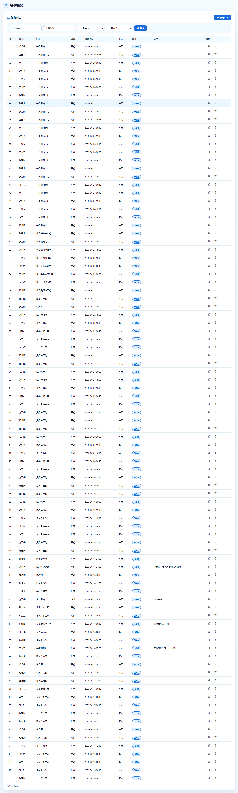

图4-10 提醒任务

#### 关键代码展示

```java
@RequestMapping("/reminderTaskList")
public String reminderTaskList(Model model, ReminderTask reminderTask) {
    model.addAttribute("reminderTaskList", reminderTaskService.reminderTaskList(reminderTask));
    return "pages/reminder-task-info";
}
```

```html
<select class="select" name="taskType">
    <option value="">全部类型</option>
    <option value="MEDICATION">用药</option>
    <option value="MEAL">用餐</option>
    <option value="ACTIVITY">活动</option>
    <option value="FOLLOW_UP">随访</option>
</select>
```

```javascript
function delTask(id) {
    if (confirm('确认删除这条提醒任务？')) {
        location.href = '/record/reminderTaskDel?id=' + id;
    }
}
```

#### 小结

提醒任务模块将护理过程中的日常提醒结构化管理，适用于用药提醒、活动提醒和随访提醒等场景。

### 4.11 陪伴记录模块

#### 模块概述

陪伴记录模块位于“情感交互-陪伴记录”，对应访问地址为 `/record/accompanyRecordList`。页面用于记录护理人员、家属或系统终端对老人的陪伴情况，字段包括陪伴类型、开始时间、结束时间、时长、陪伴人员、陪伴内容、情绪结果和备注。

#### 功能实现说明

| 功能点 | 页面/接口 | 实现说明 |
| --- | --- | --- |
| 陪伴记录列表 | `/record/accompanyRecordList` | 查询并展示陪伴服务记录。 |
| 新增陪伴记录 | `/record/accompanyRecordAddView`、`/record/accompanyRecordAdd` | 记录陪伴类型、人员、内容和情绪结果。 |
| 编辑回显 | `/record/accompanyRecordUpdateView?id=...` | 查询已有陪伴记录并回填表单。 |
| 删除记录 | `/record/accompanyRecordDel?id=...` | 删除指定陪伴记录。 |
| 情绪筛选 | `emotionResult=STABLE/HAPPY/SAD` | 按老人陪伴后的情绪结果筛选。 |

#### 页面截图展示

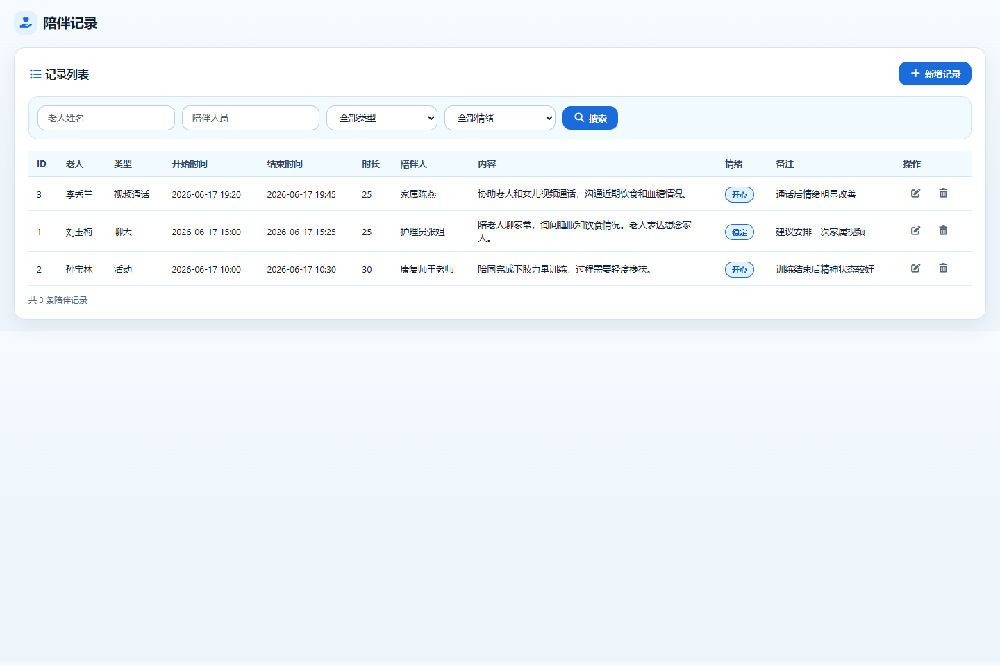

图4-11 陪伴记录

#### 关键代码展示

```java
@RequestMapping("/accompanyRecordList")
public String accompanyRecordList(Model model, AccompanyRecord accompanyRecord) {
    model.addAttribute("accompanyRecordList", accompanyRecordService.accompanyRecordList(accompanyRecord));
    return "pages/accompany-record-info";
}
```

```html
<td class="text-cell" th:text="${item.content}"></td>
<td><span class="badge"
          th:classappend="${item.emotionResult == 'HAPPY' ? ' happy' : (item.emotionResult == 'SAD' ? ' sad' : ' stable')}"
          th:text="${item.emotionResult == 'HAPPY' ? '开心' : (item.emotionResult == 'SAD' ? '低落' : '稳定')}"></span></td>
```

#### 小结

陪伴记录模块用于沉淀老人情感陪护过程，能够辅助护理人员复盘陪伴服务质量和老人情绪变化。

### 4.12 行为记录管理模块

#### 模块概述

行为记录管理模块位于“行为报告-行为记录管理”，对应访问地址为 `/report/behaviorRecordList`。页面用于记录老人活动、睡眠、用药和异常行为，展示行为类型、行为名称、位置、开始时间、结束时间、持续分钟、风险等级、来源设备和备注。

#### 功能实现说明

| 功能点 | 页面/接口 | 实现说明 |
| --- | --- | --- |
| 行为记录列表 | `/report/behaviorRecordList` | 查询行为记录并返回列表页。 |
| 新增行为记录 | `/report/behaviorRecordAddView`、`/report/behaviorRecordAdd` | 新增老人行为事件。 |
| 编辑行为记录 | `/report/behaviorRecordUpdateView?id=...` | 回显并修改行为记录。 |
| 删除行为记录 | `/report/behaviorRecordDel?id=...` | 删除指定行为记录。 |
| 搜索筛选 | `elderName`、`behaviorType`、`riskLevel` | 按老人、行为类型和风险等级查询。 |

#### 页面截图展示

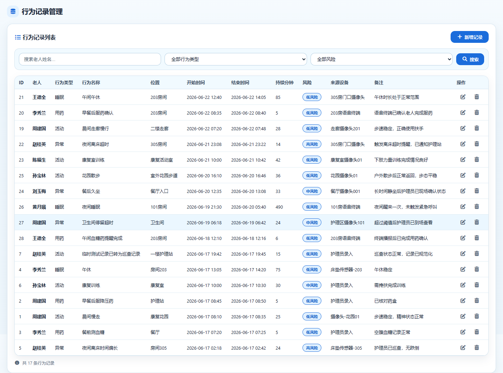

图4-12 行为记录管理

#### 关键代码展示

```java
@RequestMapping("/behaviorRecordList")
public String behaviorRecordList(Model model, BehaviorRecord behaviorRecord) {
    model.addAttribute("behaviorRecordList", behaviorRecordService.behaviorRecordList(behaviorRecord));
    return "pages/behavior-record-info";
}
```

```javascript
function queryRecords() {
    const elderName = document.getElementById('elderNameInput').value;
    const behaviorType = document.getElementById('behaviorTypeInput').value;
    const riskLevel = document.getElementById('riskLevelInput').value;
    window.location.href = '/report/behaviorRecordList?elderName=' + encodeURIComponent(elderName)
        + '&behaviorType=' + encodeURIComponent(behaviorType)
        + '&riskLevel=' + encodeURIComponent(riskLevel);
}
```

#### 小结

行为记录管理模块是日常报告生成的数据基础，能够把老人日常行为按类型和风险等级进行结构化管理。

### 4.13 日常报告生成模块

#### 模块概述

日常报告生成模块位于“行为报告-日常报告生成”，对应访问地址为 `/report/dailyReportList`。页面支持选择老人和日期生成日常报告，并在列表中展示报告日期、记录数、活动分钟、睡眠分钟、用药次数、异常次数、风险等级、摘要和建议。

#### 功能实现说明

| 功能点 | 页面/接口 | 实现说明 |
| --- | --- | --- |
| 报告列表 | `/report/dailyReportList` | 查询已生成的日常报告。 |
| 生成报告 | `/report/generateDailyReport` | 根据老人 ID 和日期汇总行为记录生成报告。 |
| 删除报告 | `/report/dailyReportDel?id=...` | 删除指定报告记录。 |
| 风险展示 | `riskLevel` | 根据低、中、高风险显示不同样式。 |

#### 页面截图展示


图4-13 日常报告生成

#### 关键代码展示

```java
@RequestMapping("/dailyReportList")
public String dailyReportList(Model model, DailyReport dailyReport) {
    fillDailyReportPage(model, dailyReport);
    return "pages/daily-report-info";
}
```

```java
@RequestMapping("/generateDailyReport")
public String generateDailyReport(@RequestParam("elderId") Integer elderId,
                                  @RequestParam("reportDate") @DateTimeFormat(pattern = "yyyy-MM-dd") Date reportDate,
                                  Model model,
                                  HttpServletRequest request) {
    try {
        DailyReport report = dailyReportService.generate(elderId, reportDate);
        operationLogService.record("behavior report", "generate", "generate daily report id: " + report.getId(), request);
        return "redirect:/report/dailyReportList";
    } catch (RuntimeException e) {
        fillDailyReportPage(model, new DailyReport());
        model.addAttribute("errMsg", e.getMessage());
        return "pages/daily-report-info";
    }
}
```

```html
<td th:text="${report.totalRecords}">3</td>
<td th:text="${report.activityMinutes}">60</td>
<td th:text="${report.sleepMinutes}">420</td>
<td th:text="${report.medicationCount}">2</td>
<td th:text="${report.abnormalCount}">0</td>
```

#### 小结

日常报告生成模块把零散行为记录汇总为护理报告，适合用于每日护理复盘和风险评估展示。

### 4.14 角色权限控制模块

#### 模块概述

角色权限控制模块位于“系统管理-角色权限控制”，对应访问地址为 `/role/roleList`。页面用于维护系统角色，并通过角色表单勾选权限资源，实现角色与页面访问地址之间的绑定。

#### 功能实现说明

| 功能点 | 页面/接口 | 实现说明 |
| --- | --- | --- |
| 角色列表 | `/role/roleList` | 查询角色编码、名称、排序、状态和备注。 |
| 新增角色 | `/role/addView`、`/role/add` | 新增角色并保存权限资源关系。 |
| 编辑角色 | `/role/updateView?id=...`、`/role/update` | 查询角色详情和已选权限并回显。 |
| 删除角色 | `/role/del?id=...` | 删除角色前清理角色权限和用户角色关系。 |
| 权限分配 | `permissionIds` | 通过复选框提交角色拥有的权限资源。 |

#### 页面截图展示


图4-14 角色权限控制

#### 关键代码展示

```java
@RequestMapping("/roleList")
public String roleList(Model model, Role role) {
    model.addAttribute("roleList", roleService.roleList(role));
    return "pages/role-info";
}
```

```java
public void delete(Integer id) {
    getById(id);
    roleDao.deleteRolePermissions(id);
    userRoleDao.deleteByRoleId(id);
    roleDao.delete(id);
}
```

```java
public void savePermissions(Integer roleId, List<Integer> permissionIds) {
    roleDao.deleteRolePermissions(roleId);
    if (permissionIds != null && !permissionIds.isEmpty()) {
        roleDao.batchAddRolePermissions(roleId, permissionIds);
    }
}
```

#### 小结

角色权限控制模块是系统权限体系的核心，决定不同用户登录后能看到哪些菜单以及能访问哪些页面。

### 4.15 权限资源管理模块

#### 模块概述

权限资源管理模块可从角色权限控制页面进入，对应访问地址为 `/permission/permissionList`。该页面用于维护系统可授权资源，包括权限编码、权限名称、权限 URL、权限类型、父级 ID、排序、状态和备注。

#### 功能实现说明

| 功能点 | 页面/接口 | 实现说明 |
| --- | --- | --- |
| 权限列表 | `/permission/permissionList` | 查询全部权限资源。 |
| 新增权限 | `/permission/addView`、`/permission/add` | 新增页面权限或按钮权限。 |
| 编辑权限 | `/permission/updateView?id=...` | 根据 ID 回显权限资源。 |
| 删除权限 | `/permission/del?id=...` | 删除指定权限资源。 |
| 资源搜索 | `permCode`、`permName`、`permUrl` | 支持按编码、名称、URL 模糊查询。 |

#### 页面截图展示

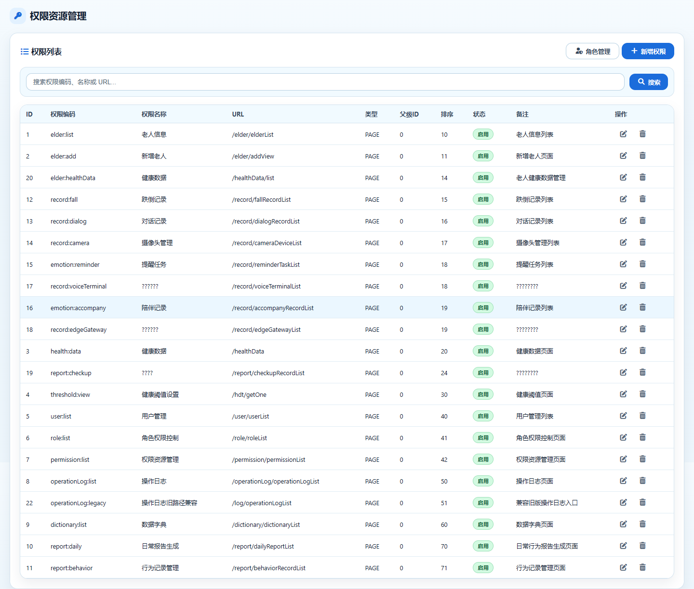

图4-15 权限资源管理

#### 关键代码展示

```java
@RequestMapping("/permissionList")
public String permissionList(Model model, Permission permission) {
    model.addAttribute("permissionList", permissionService.permissionList(permission));
    return "pages/permission-info";
}
```

```javascript
function queryPermissions() {
    const keyword = document.getElementById('searchInput').value;
    window.location.href = '/permission/permissionList?permCode=' + encodeURIComponent(keyword)
        + '&permName=' + encodeURIComponent(keyword)
        + '&permUrl=' + encodeURIComponent(keyword);
}
```

#### 小结

权限资源管理模块为菜单显示和拦截器鉴权提供基础资源数据，是动态权限控制的底层配置页面。

### 4.16 操作日志模块

#### 模块概述

操作日志模块位于“系统管理-操作日志”，对应访问地址为 `/operationLog/operationLogList`。页面用于查看登录、退出、新增、修改、删除等关键操作记录，展示操作人、模块名称、操作类型、操作内容、IP 地址、状态和操作时间。

#### 功能实现说明

| 功能点 | 页面/接口 | 实现说明 |
| --- | --- | --- |
| 日志列表 | `/operationLog/operationLogList` | 查询系统操作日志。 |
| 日志搜索 | `operatorName`、`moduleName`、`operationType` | 按操作人、模块和操作类型筛选。 |
| 自动记录 | `operationLogService.record(...)` | 业务操作完成后写入日志。 |
| 删除日志 | `/operationLog/del?id=...` | 删除指定日志记录。 |

#### 页面截图展示


图4-16 操作日志

#### 关键代码展示

```java
@RequestMapping("/operationLogList")
public String operationLogList(Model model, OperationLog operationLog) {
    model.addAttribute("operationLogList", operationLogService.operationLogList(operationLog));
    return "pages/operation-log-info";
}
```

```java
operationLogService.record("user", "add", "add user: " + user.getLoginName(), request);
operationLogService.record("user", "update", "update user: " + user.getLoginName(), request);
operationLogService.record("user", "delete", "delete user id: " + id, request);
```

```javascript
function queryOperationLogs() {
    const keyword = document.getElementById('searchInput').value;
    window.location.href = '/operationLog/operationLogList?operatorName=' + encodeURIComponent(keyword)
        + '&moduleName=' + encodeURIComponent(keyword)
        + '&operationType=' + encodeURIComponent(keyword);
}
```

#### 小结

操作日志模块增强了后台系统的可追溯性，能够记录关键管理行为，便于排查问题和进行操作审计。

### 4.17 数据字典模块

#### 模块概述

数据字典模块位于“系统管理-数据字典”，对应访问地址为 `/dictionary/dictionaryList`。页面用于维护系统基础枚举数据，例如状态、类型、等级等字段的编码和值，减少页面选项和业务配置中的硬编码。

#### 功能实现说明

| 功能点 | 页面/接口 | 实现说明 |
| --- | --- | --- |
| 字典列表 | `/dictionary/dictionaryList` | 查询字典类型、编码、名称、值、排序和状态。 |
| 新增字典 | `/dictionary/addView`、`/dictionary/add` | 新增系统基础字典项。 |
| 编辑字典 | `/dictionary/updateView?id=...` | 根据 ID 查询并回显字典项。 |
| 删除字典 | `/dictionary/del?id=...` | 删除指定字典项。 |
| 字典搜索 | `dictType`、`dictCode`、`dictName` | 按类型、编码、名称模糊筛选。 |

#### 页面截图展示

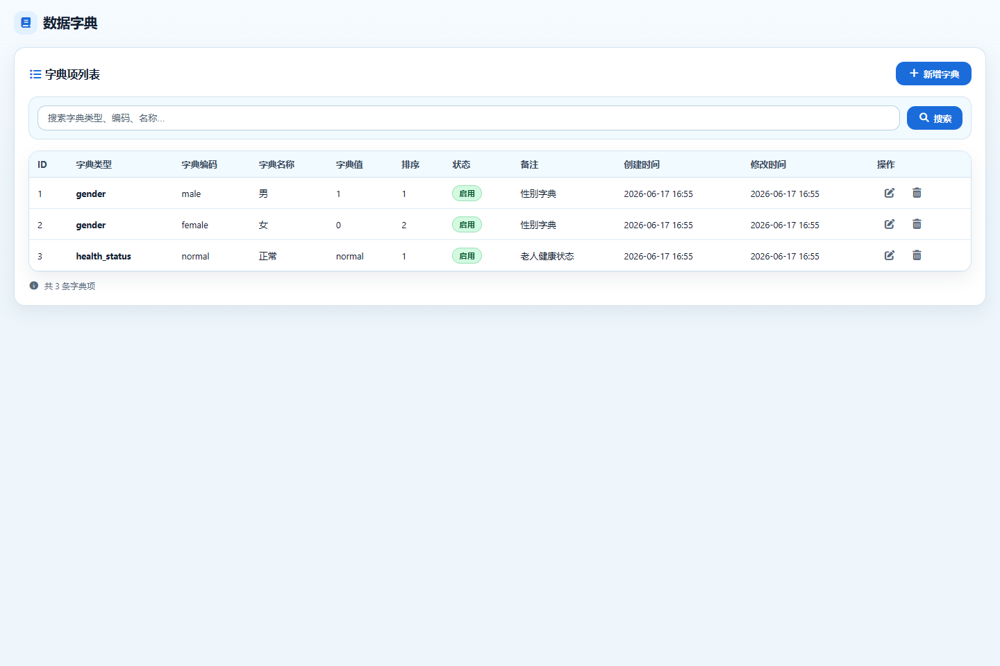

图4-17 数据字典

#### 关键代码展示

```java
@RequestMapping("/dictionaryList")
public String dictionaryList(Model model, DataDictionary dictionary) {
    model.addAttribute("dictionaryList", dataDictionaryService.dictionaryList(dictionary));
    return "pages/data-dictionary-info";
}
```

```javascript
function queryDictionaries() {
    const keyword = document.getElementById('searchInput').value;
    window.location.href = '/dictionary/dictionaryList?dictType=' + encodeURIComponent(keyword)
        + '&dictCode=' + encodeURIComponent(keyword)
        + '&dictName=' + encodeURIComponent(keyword);
}
```

```html
<tr th:each="dict : ${dictionaryList}">
    <td th:text="${dict.dictType}">gender</td>
    <td th:text="${dict.dictCode}">male</td>
    <td th:text="${dict.dictName}">男</td>
    <td th:text="${dict.dictValue}">1</td>
    <td th:text="${dict.sortNo}">0</td>
</tr>
```

#### 小结

数据字典模块为系统基础配置提供统一维护入口，使页面下拉选项、状态值和类型值更容易管理和扩展。

## 五、开发过程页

### 5.1 开发流程

本系统开发过程按照“数据库设计 -> 实体类与 Mapper 编写 -> Service 业务封装 -> Controller 请求处理 -> Thymeleaf 页面渲染 -> 功能测试与截图整理”的顺序推进。

1. 数据库设计：根据养老管理业务划分用户、角色、权限、老人、健康数据、设备、行为记录、日志等数据表。
2. 后端分层开发：每个业务模块基本对应 Entity、Dao、Mapper、Service、Controller，保证代码职责清晰。
3. 前端页面开发：使用 Thymeleaf 编写后台管理页面，通过左侧菜单切换右侧内容区。
4. 权限与菜单联动：登录后把权限地址保存到 Session，左侧菜单根据权限变量控制显示。
5. 功能验证：对登录、列表查询、新增、编辑、删除、搜索筛选等后台常用流程进行验证，并整理截图。

### 5.2 典型技术难点与解决思路

| 技术难点 | 问题表现 | 解决思路 |
| --- | --- | --- |
| 左侧菜单需要根据权限动态显示 | 不同角色登录后应看到不同菜单，如果全部写死会导致权限控制不准确。 | 登录成功后查询当前用户的角色和权限地址，保存到 Session；`FrameController` 根据权限生成 `canUser`、`canRole`、`canHealthData` 等布尔值；`left.html` 使用 `th:if` 控制菜单显示。 |
| 页面访问需要鉴权 | 用户未登录或无权限时仍可能直接输入 URL 访问后台页面。 | 编写 `AuthInterceptor` 拦截请求；登录页和静态资源放行；普通页面先判断 Session 登录状态，再判断权限地址是否匹配，不符合条件时跳转到无权限页面。 |
| 新增和编辑表单重复度高 | 用户新增和编辑字段基本一致，如果写两个页面会造成维护成本增加。 | 复用 `user-add.html` 表单模板，通过 `formAction` 区分新增和编辑提交地址，通过 `th:object`、`th:field` 自动完成数据绑定和回显。 |
| 用户与角色是多对多关系 | 保存用户时不仅要保存用户基础信息，还要维护用户角色关联表。 | 新增用户后使用 `useGeneratedKeys` 获取用户 ID，再写入 `t_user_role`；编辑时先删除旧角色关联，再批量写入新角色关联。 |
| 删除用户可能留下关联脏数据 | 如果只删除 `t_user`，`t_user_role` 中会保留无效用户 ID。 | 在 `UserService.delete` 中先执行 `userRoleDao.deleteByUserId(id)`，再执行 `userDao.delete(id)`，保证关联数据同步清理。 |
| 模糊搜索需要支持多个字段 | 用户希望一个搜索框同时按登录名、姓名、电话查询。 | 前端将关键字同时传给 `loginName`、`realName`、`phone`；MyBatis 使用动态 SQL 拼接 `like` 条件，`<where>` 标签自动处理开头的 `or`。 |
| 中文页面和数据库编码问题 | 页面、请求参数或数据库内容可能出现乱码。 | 项目统一配置 UTF-8 编码，`spring.thymeleaf.encoding=UTF-8`、`server.servlet.encoding.force=true`，数据库连接使用 `useUnicode=true&characterEncoding=utf8`。 |

### 5.3 权限控制实现思路

登录时，系统会校验用户账号、密码和启用状态。登录成功后，系统把当前用户、角色名称、角色编码和权限 URL 写入 Session：

```java
request.getSession().setAttribute("loginUser", user);
request.getSession().setAttribute("permissionUrls", roleService.getPermissionUrlsByUserId(user.getId()));
request.getSession().setAttribute("roleNames", roleService.getRoleNamesByUserId(user.getId()));
request.getSession().setAttribute("roleCodes", roleService.getRoleCodesByUserId(user.getId()));
```

页面加载左侧菜单时，`FrameController` 根据 Session 中的权限地址判断当前用户是否能访问某个模块，并将判断结果传给模板：

```java
model.addAttribute("canUser", canAccess(superAdmin, permissionUrls, "/user/userList"));
model.addAttribute("canRole", canAccess(superAdmin, permissionUrls, "/role/roleList"));
model.addAttribute("canThreshold", canAccess(superAdmin, permissionUrls, "/hdt/getOne"));
```

左侧菜单模板再根据变量决定是否显示对应菜单：

```html
<button class="nav-item" type="button"
        data-page="userMgmt"
        data-url="/user/userList"
        th:if="${canUser}">
    <i class="fas fa-users-cog"></i><span>用户管理</span>
</button>
```

### 5.4 开发成果总结

项目完成了银发守护后台管理系统的基础管理闭环，包含登录鉴权、动态菜单、老人档案、健康数据、健康阈值、设备记录、行为报告、角色权限、用户管理和操作日志等功能。其中用户管理模块实现了较完整的后台业务流程，能够展示学生对 Spring Boot、Thymeleaf、MyBatis、MySQL 组合开发模式的掌握情况。

从代码结构上看，项目采用清晰的分层开发方式；从功能实现上看，系统覆盖了常见后台管理功能；从展示材料上看，技术栈、功能模块、用户管理核心流程、开发难点与解决方案均可以形成完整的项目汇报内容。
